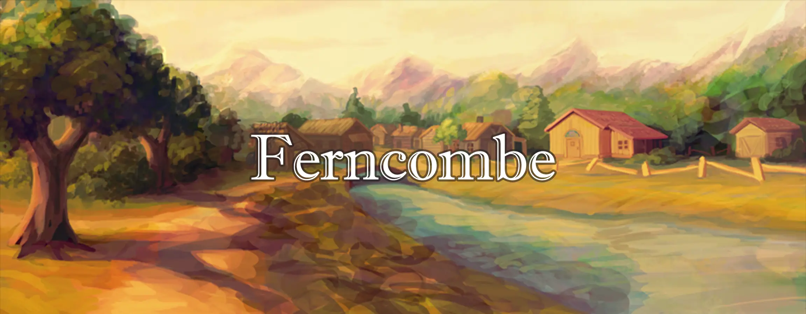

# Ferncombe
The humble township of Ferncombe is a quaint farming and fishing community, a pastoral and serene home away from home.

# What is Ferncombe?

Ferncombe is a quiet and peaceful town, full of character and charm. Created and delivered by the team behind A House Divided, Ferncombe is intentionally designed to fit seamlessly into just about any fantasy setting, making it an easy addition to an existing campaign or the perfect starting point for a new one!

## Features
* A small settlement with a rich and colorful history, detailed throughout a series of journals
* Contains detailed guidance on roleplaying Ferncombe's residents, with biographies, personalities, and more!
* Original portraits for nine prominent NPCs
* Descriptions of the town's shops and businesses
* Exquisite and high-resolution artwork of the town

## Credits
### Concept and Writing

Ferncombe and all of her characters are an original work created by Shane Martland and Roman Trevisanut
Journals were edited and formatted with assistance from Viviane Charlier

### Artwork

The Ferncombe landscape and all character portraits were created by Drew Smith

### Visual Design

This module uses substantial portions of the House Divided CSS by Andrew Clayton and Shane Martland
It was adapted for this standalone module by Viviane Charlier

### Special thanks

Cody Swendrowski for helping to dredge Ferncombe from the cutting room floor
